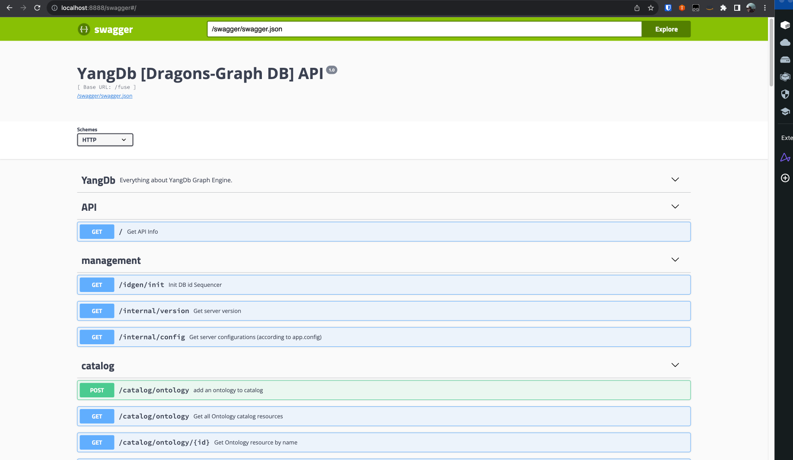

# Running The Dragons Graph 
This tutorial explains how to run the Dragons graph sample distrib application on top of the Opensearch engine using the docker-compose.

The next [docker-compose](docker-compose-os.yml) is used to run the next services
 - OpenSearch
 - OpenSearch-dashboards
 - Fuse - (The Dragons Graph engine)

## Building
First we need to build the distribution folder that includes the dragons assemble.
run the next bash script `./buildDocker.sh Dragons` [here](runDocker.sh)
> Note: to make the script executable run `chmod +x start-fuse-service.sh`

Running this will result in the following steps:
- It will take the tag name (Dragons) given by the command line to create the docker image (`yangdb/yang.db:Dragons`)
- It will run the maven build command (`mvn clean install -DskipTests=true install -P core,dragons-assembly`)
- It will generate the target folder (distrib/dragons) which include the jars and script for running the graph engine (Fuse)
- It will generate the docker image based on the above folder

Once this process is complete - Run the docker-compose command:

## Running the Docker-compose services
The docker compose command `docker-compose -f docker-compose-os.yml up -d` will start all the relevant services
 - OpenSearch - http://localhost:9200 
 - OpenSearch-Dashboard - http://localhost:5601 
 - Fuse-Graph - http://localhost:8888

Once all services are up - navigate to the http://localhost:8888/swagger# url to verify the correctness of the Graph engine.

## Swagger API
The next API references allows access to all the Graph's functionality and configuration.
 - See [Docs](../docs/info/api.md)



### Calling the Get Info API
Navigate to the next URL `http://localhost:8888/swagger#/API/get_` and call the `execute `

The next response is expected:
```json5
{
  "requestId": "FR870994186772480000",
  "elapsed": "00000080",
  "renderElapsed": "00000313",
  "totalElapsed": "00000393",
  "data": {
    "resourceUrl": "/fuse",
    "resourceId": null,
    "healthUrl": "/fuse/health",
    "internal": "/fuse/internal",
    "queryStoreUrl": "http://172.27.0.4:8888/fuse/query",
    "searchStoreUrl": "/fuse/search",
    "catalogStoreUrl": "http://172.27.0.4:8888/fuse/catalog/ontology"
  }
}
```
## Dragons Tutorial
For more advanced usage and tutorial please refer to the [Tutorials folder](../docs/tutorial)
- [Dragons Tutorial Installation](../docs/tutorial/sample/dragons/installation.md)
- [Dragons Tutorial Ontology](../docs/tutorial/sample/dragons/create-ontology.md)
- [Dragons Tutorial Data](../docs/tutorial/sample/dragons/load-data.md)
- [Dragons Tutorial Query](../docs/tutorial/sample/dragons/query-the-data.md)
- [Dragons Tutorial Projections](../docs/tutorial/sample/dragons/projection-and-count.md)