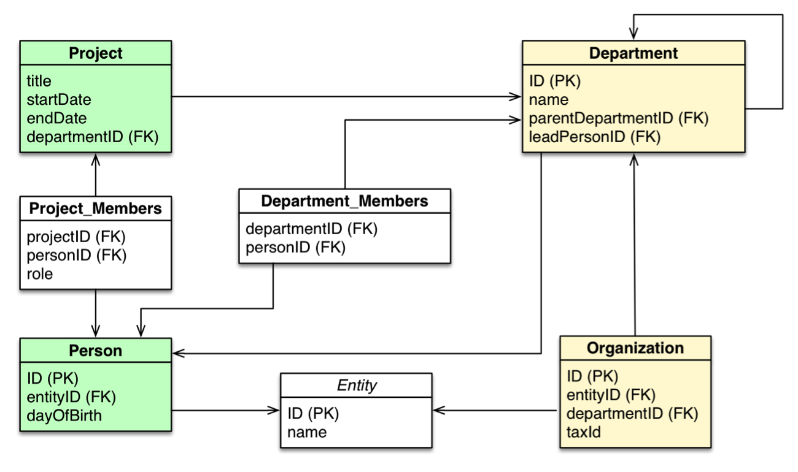
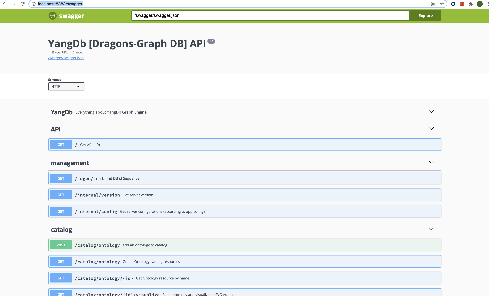

## Knowledge Graph On OpenSearch

In lights of the prominent rise of knowledge Data Bases and the understanding that such modern data abstractions (ontology) better suits the real world use cases - It is essential that any search engine must be enhanced with such capabilities.

Many of the real world use cases resembling graph more than anything else, this is why we would like to allow every data consumer query his data in a way that allow the domain experts to ask questions that closely relate to their business entities with an appropriate language.

Such a knowledge graph capability & semantics would allow us to ask questions resembling our business use cases with a more fluent and native way  that bring closer the business entities with the query semantics.

### Relationship Matter

In the real world the nature of the relationship between our business entities can give us great value and allow us to understand patterns in the data.

In most of the standard stores (RDBMS / Column / Document / KeyValue) we are facing a hard time reflecting the true and dynamic nature of relations that the entities maintain and create.

This is due to the distinct physical nature of each store and its specific capabilities & performance goals.

In an ideal world we would like to abstract this physical considerations in favor of maintaining a **Domain logical layer** (Ontology) for the entities and their evolving relationships.

### YangDb Knowledge Graph

In this desk I would like to present YangDb - open source knowledge graph extension for opensearch.

Focus on the next elements:
- Ontology layer adding a knowledge domain on top of the physical indexes structure
- Query semantics (cypher) that focus on the domain entities and hide the underlaying complexities
- Logical & physical execution planner that optimize execution on top of the actual data

I will show a working demo and finally discuss a work-plan of integrating its capabilities into opensearch as a plug-in.

### Where is the World Going To (SQL)

In the past year the industry has come to understand and accept the need to do graph query on top of (part of) the standard SQL language. The open cypher initiative was a large part of this direction and contributed to the understanding that such support is needed for the community.

https://www.opencypher.org/articles/2019/09/12/SQL-and-now-GQL/
https://pgql-lang.org/
https://www.gqlstandards.org/

### Involved factors:

**• ISO:**
    
    • JTC 1 / SC32 / WG3
    • USA, Germany, Japan, UK, Canada, China

**• ANSI:**

        • INCITS / DM32 / DM32.2 / DM32.2 Ad Hoc Group on SQL Extensions for Property Graphs
        • Oracle, Neo4j, TigerGraph, IBM, SAP/Sybase, JCC Consulting


### SQL Capabilities & Future needs
It is clear that SQL is the queen of all the query languages and supported almost everywhere, but It can be very hard to do knowledge and analytical questions using SQL only…

In opensearch  SQL was added to address some of these need but still the strong association between	the actual tables and the physical indexes is unavoidable.

We would like to ask logical questions that are somewhat separated from the physical structure to allow a better semantics for our business entities.

We would also want to simplify the data correlation and joining of separated indexes regardless of their actual mapping - releasing the question form the actual low level internal join details.
Join question of different entities can become very complex and performant delicate in standard SQL - using a graph expression language would simplify this task:

---

Lest see the next example:



**sql statement:**
```
select name from person
    left join person_department on person.id = person_department.personid
    left join department  on department.id = person_department.departmentid
where department.name = "it department"
```

**cypher statement:**

```
match (p:person)<-[:employee]-(d:department)
where d.name = "it department"
return p.name
```

The sql here is twice longer, error prone (join columns) and performant depended on join reordering of one supported…
SQL is well-optimized for relational database models, but once it has to handle complex, relationship-oriented queries, its performance quickly degrades.

### Domain Evolution & Multi-tenant
In many cases we would like to change or decouple (evolve) some business entities on our dataset, such changes many time cause us to re-index our store according to our new domain model.

In the logical ontology we are making a strong effort separating these logical-physical entities so that many of the logical changes would not necessary force us to reindex the data.
Such capability can save us time & money and free us from the fear of changing data entities in our domain.

Since such separation exist - it also gives us the capability to model the same physical data in two different ontologies and to be able to ask different questions on the same actual data without the need to duplicate it - all using the logical layer abstraction capability.

#### Yang-DB Logical & physical models

As explained there are two types of models to describe our data
- the logical schema which we call Ontology
- the physical schema (index structure & mapping)

We would like to support both the complexities of the logical entities semantics & the actual physical structure of the indexes to allow optimisation of physical aspects like speed and space.

**Lets view the Ontology:**

```
{
    "ont": "Dragons", // name of the logical ontology
    "entityTypes": [  // entities types & properties
    {
        "eType": "Person", //logical Person entity
        "name": "Person",
        "metadata": [
            "id",
            "type"
        ],
        "properties": [ // Person entity fields
            "firstName",
            "lastName",
            "gender",
            "birthDate",
            "deathDate",
            "height",
            "name",
            "profession"
        ]
    }
    …
    ],
    "relationshipTypes": [// relationship types & properties
    {
    "rType": "Own", //Own type relationship
    "name": "Own",
        "ePairs": [ //the possible participants of this relationship
            {
            "eTypeA": "Person",
            "eTypeB": "Dragon"
            },
            {
            "eTypeA": "Person",
            "eTypeB": "Horse"
            }
        ],
        "metadata": [
            "id",
            "type"
        ],
        "properties": [
            "startDate",
            "endDate"
        ]
    }
    …
```

The logical entities and relationships are presented here with their properties. 
Next the physical representation which describes some store related instructions:

 - indexes can represent single / multiple / hierarchy (logical) entities & relationships
 - mapping can also determine aspects of the storage considerations
```
{
  "ontology":"Dragons",
  "entities": [     //physical entities index manifestation 
    {
      "type": "Dragon",
      "partition": "static",
      "mapping":"Index",
      "props": {
        "values": ["dragon"]
      }
    },
    ...

   {
      "type": "Fire",   //physical relationship index manifestation 
      "partition": "time", // time partitioned index
      "mapping":"Index",
      "symmetric":true,
      "redundant": [
        {
          "side":["entityA","entityB"], //mapping keys for the foriegn keys names
          "redundant_name": "name",     //redundant data replication for query optimization
          "name": "name",
          "type": "string"
        },
        {
          "side":["entityA","entityB"],
          "redundant_name": "color",
          "name": "color",
          "type": "string"
        }
      ],
      "props": {                       //partitioning related information
        "partition.field": "date",
        "prefix": "idx_fire",
        "index.format": "idx_fire_%s",
        "date.format": "YYYY",
        "values": ["500", "1000", "1500","2000"]
      }

```

As shown lower level store aspects are represented here and can be configured for space & store optimization.

### REST API
 	 
Yang-DB offers a rich REST API to handle all the relevant functionalities:
 - Operational
 - Monitoring
 - Catalog 
 - Ingestion
 - Query

We will focus on the query part to demonstrate these capabilities:


### Query

The purpose of the graph language was to ease these exact hard constraints and to allow a more free (logical) language the has no explicit instruction of the way the algebric relation
should be resolved (Join in SQL) and all the patterns are present in a logical format.

In the next image we can visualize the simple cypher pattern

    (person)-[likes]-(message) 

versus the composite and large explicit SQL equivalent query:


Now that we recognize the advantage of this semantics - lets review the data representation of YangDB:


### Query Execution
**- Query is a resource**
 1) Each query resource is being validated and rewritten to an AST tree that represents the actual logical traversal
        

 
 2) A cursor resource is the place where the actual data traversal is happening, the query logical plan is transformed to a physical
execution plan using unipop (gremlin based) graph traversal engine which later is translated to opensearch DSL.
  

 3) Data is fetched in pages while each page can be cached locally or disposed after usage.
    
#### Results Projection
 
Results can be projected as assignments, tables or sub-graph 
Since the cursor represents a point in time with respect to the actual data, a new cursor on the same query can return different results...

# DEMO
The demo will show the Game Of Thrown Ontology and will demonstrate 
 - Creating the logical ontology
 - Loading CSV data to the Graph
 - Query the data and view results

# Questions
 * ???
 * ???
 * ???

# Roadmap
Review the planned roadmap for Knowledge graph opensearch plugin

 - Support logical ontology
 - Support PGQL query language
 - Support Execution Cost Based Planner
 - Support Distributed Join Execution

