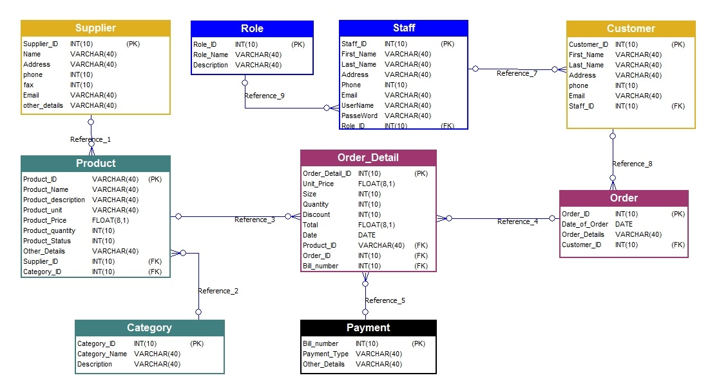

# Catalog
The purpose of this document is to explain and discuss the need for a generalized catalog concepts and structure.
 - It will discuss the general needs for a data-catalog representation and its usage during query execution and data discovery. 
 - It will review the existing solutions for maintaining a catalog repository in the open source domain.
 - It will define the common internal structure for such a catalog  

## Why Do we need a Catalog

The modern data stores and engines experience an extreme growth in the volume, variety, and velocity of data.
Many of which are 'on demand' data-sets which are partially structured (or not structured at all).
While this type of systems tend to offer some data discovery method to navigate the large amount of the diverse data, 
they sometimes tend to neglect the common practice of generating on-the-fly data structures (projections and materializations) that are 
being used similar to the raw data sets. 

-------------

### Definition

One of the simplest definitions for a data catalog goes as follows:
“Simply put, a data catalog is an organized inventory of data assets in the organization. It uses metadata to help organizations manage their data.
It also helps data professionals collect, organize, access, and enrich metadata to support data discovery and governance.”

In a modern enterprise, though, we have a dazzling array of different types of assets that comprise the landscape:
tables in relational databases or in NoSQL stores, streams in your stream store, features in your AI system, metrics in your metrics platform, dashboards in your  visualization tool, etc. 
The modern data catalog is expected to contain an inventory of all these kinds of data assets. 

### Usages

An important question concerns the kind of metadata we want to store in the data catalog, because that directly influences the use cases we can enable.

Some common use cases:

 - Search and Discovery: Data schemas, fields, tags, usage information
 - Access Control: Access control groups, users, policies
 - Data Lineage: Pipeline executions, queries, API logs, API schemas
 - Compliance: Taxonomy of data privacy/compliance annotation types
 - Data Management: Data source configuration, ingestion configuration, retention configuration, data purge policies, data export policies
 - Data Ops: Pipeline executions, data partitions processed, data statistics
 - Data Quality: Data quality rule definitions, rule execution results, data statistics

Every individual use case often brings in its own special metadata needs, and yet also requires connectivity to existing metadata brought in by other use cases. 

### Solutions

Metadata can be typically ingested using the following methods:

 - crawling based approach by connecting to sources of metadata like your database catalog, the Hive catalog, the Kafka schema registry, or your workflow orchestrator’s log files
and then writing this metadata into the primary store, with the portions that need indexing added into the search index .
   
This ingestion proccess is usually running once a day or so. During the ingestion, there is often some transformation of the raw metadata into the semantic metadata model,
because the data is rarely in the exact form that the catalog wants it. Typically, this transformation is embedded into the ingestion job directly. 

This is a pull oriented metadata collection method and the crawler runs in a different environment than the data source and its configuration needs to be managed separately.
So, one set of problems in these pipelines is operational hurdles like network connectivity (firewall rules) or credential sharing (passwords can change).
In addition, this type of metadata ingestion typically leads to workloads that are batchy (nightly refreshing from the source) and non-incremental this most likely effects
the (meta)data freshness quality.
-------------
 
- a (front-end) service that sits in front of the metadata storage database. 
The service offers an API that allows metadata to be written into the system using push mechanisms, and programs that need to read metadata programmatically can read the metadata using this API.

Providing a (push-based) schematic interface immediately creates good contracts between producers of metadata and the “central metadata”

### Domain Model
After Ingestion of the (meta)data - we need to be able to access the collected data in a common way which will enable the
different domain attributes of the (collected) data models to be reflected as knowledge.

For example - we may collect RDBMS metadata of some inventory which contains details of the different tables and views in the
schema, and in-addition we also collect metadata regarding the business process (pipeline) that is applied on-top of these
tables - such as executed queries and job schedules.

**Example**

Let's examine the next inventory schema:

Here we can see that every table can be represented as a domain entity with relations to other entities.

**Example**

TODO add another example for pipline domain schema

------

This metadata contains different type of domains - we need a common logical way to represent both of these concerns.

In General - we need a general logical abstraction that can represent any type of domain and this logical representation must be 
capable of evolving without causing any physical changes.

### Knowledge Topology
We will use a property graph entity model based topology which is both generic to allow any general purpose domain semantic and 
can also evolve freely without any constraints.

The basic element of this topology are entities and relations which are labeled with some kind of type identification.
These elements also have properties that represent the fields of these domain elements.

This type of (generic) topology will also allow asking complex questions which will allow the asking side to declare a "schema on read" type
of questions.

This "schema on read" allows creating a query that will model the question & response in a specific schema that matches the domain of the query owner.  

**Example** 

### Physical Model
In addition to the logical aspect of the (meta)data - we will also like to store some lower level aspects of the collected metadata.
For example - when an entity if physically represented in the actual store as a table, we need to save the specific information of that domain entity.
If we think about the product entity - its corresponding physical representation is a table with a list of columns.

Each column has a type and may have a constraint (PK,FK)

