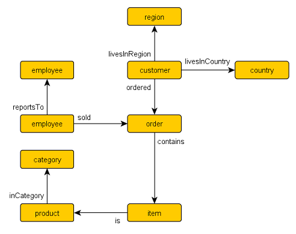

# Integration of YangDb into Open Distro Proposal
The next document is an initial draft proposal for integration of YangDB capabilities into AWS Open distro project as 
a new elasticsearch plugin for graph traversal and query capabilities.

The General idea behind this move will be to allow wide usage of the existing yangDB's graph representation of 
elasticsearch indices and allowing complex graph queries over these indices while preserving the next capabilities:

### Functional
 - Define a **physical schema** over existing/new elasticsearch indices (elasticsearch mapping)
 - Define a (abstract) **logical (Ontology) schema** over the physical schema (existing indices)
 - Make use of a popular and standard graph query language (gremlin / cypher)
 - Allow different projection for the query results
 - Allow pagination for the query results ( preserve state on the server side)
 - Add Basic Graph API such as findPath / get Neighbors / add node / add edge 
 

### Non-Functional
 - Use a cost based execution plan for optimal performance
 - Use an intermediate logical AST elements for optimization and validation
 - Use unipop as the graph traversal language, and the execution plan translator to elastic's DSL
 - Support all elasticsearch's primitive data-types 
 - Support all elasticsearch's different documents representation (parent-child, nested )

## Sample Use Cases
The next example will review use cases that this graph API can help solve and will
allow a shared reference for discussion regarding the needs and capabilities

#### Moving a RDBMS schema to Elasticsearch
In this story we will describe a use case where an existing RDBMS schema is needed to be moved into 
elasticsearch and a list of existing queries and new analytics queries must be supported.

We will present the next schema **_Northwind Graph Model_** as the RDBMS domain model.

#####  Migration Steps
 
 - Convert the DDL (DB schema definition) into an elasticsearch mappings list
 - Formulate a logical schema (ontology) that will be used to define the graph queries
 - Ingest the tables (via export to csv) using a (schema aware) graph data loader
 - Translate the existing queries into gremlin graph queries

#### Creating a logical graph based on a list of existing csv raw data files
In this story we will describe a use case where an existing Excel list of documents is needed 
to be used for analytical data queries including data correlation between the different files

`todo - add image`

#####  Migration Steps

- Formulate a logical schema (ontology) that will be used to define the graph queries
- Auto Generate the elasticsearch mappings according to the former ontology 
- Ingest the csv files using the graph data loader
- Create analytics and correlation gremlin graph queries

#### Map existing elasticsearch indices into a logical graph 
In this story we will describe a use case where an existing list of elasticsearch indices
is needed to be queries in correlation 

`todo - add image`

#####  Migration Steps

- Formulate a logical schema (ontology) that will be used to define the graph queries
- Use existing mapping to define the physical graph layer
- Create analytics and correlation gremlin graph queries

##  Proposed integration Steps and content

Our goals in this section will be to concentrate upon the next objectives:
 - **Gradually** - enable the release of this API with gradual increase of functionality
 - **Simplicity** - allow clear and simple use cases and API that will make sense and be reasonable to work with
   for none experts graph users
 - **Maintainability** - emphasize a clean code collaboration that is easy to reason about with and collaborates with
   the existing open distro code standards and conventions.

#### Initial requirements

###### Open Distro

The open distro project is based on the next conepts and components:
 - An elasticsearch Plugin
    - Elasticsearch 7.10.2
 - Gradle
 - JDK >= 14

###### Open Distro Dependencies
 
The next dependencies are the de-facto used standard in the (sql) open distro project

 - Guava
 - Lombok
 - ANTLR
 - Spring
 - Jackson

_Additional dependencies exist regarding the logging and testing infrastructure._

 

### Building Blocks