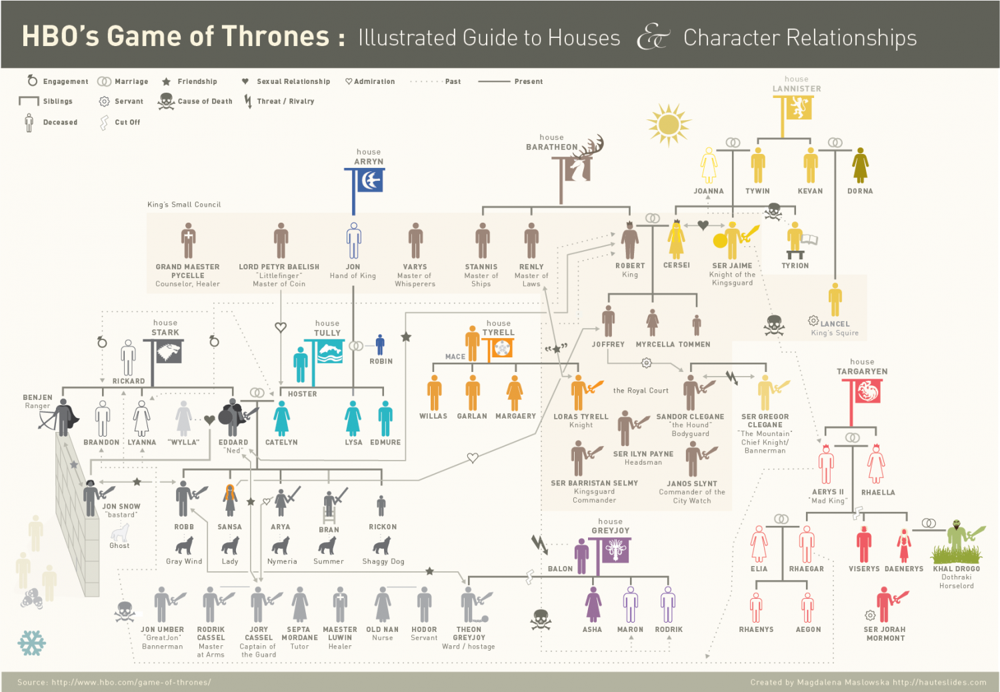
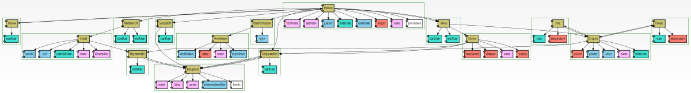
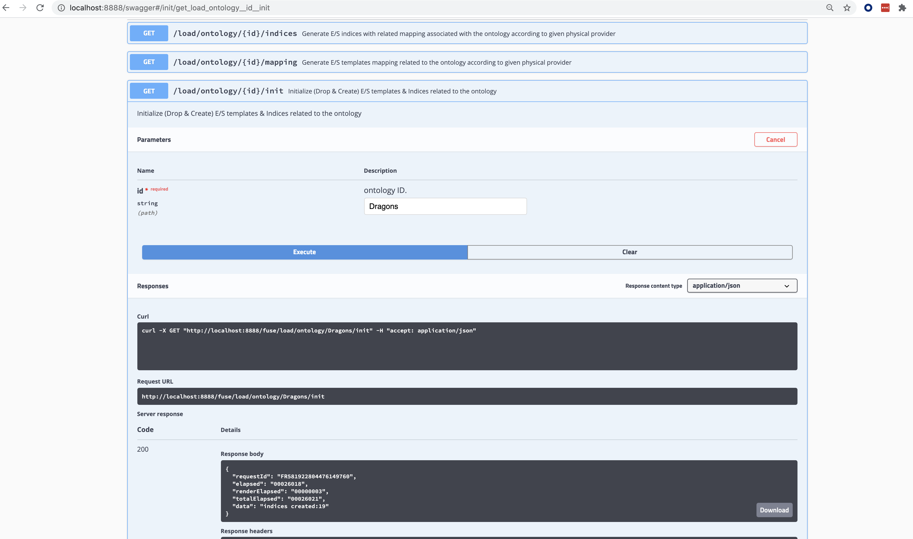

##Create an Ontology

Since we completed the installation phase (see installation documentation) we can create our
First graph ontology for the Dragons scenario.

Lets review the main entities for HBO's Game Of Thrown:

We can list the entities with respect to their functional nature : 
 - Nodes that represent labeled elements with properties
 - Edges represent labeled relationship between nodes (also having properties)

_Side node_ - only a portion of the entities are inside the ontology since we wanted to keep the
entire picture simple and clear to unfamiliar people ...

####Nodes

 - People
 - Dragons
 - Horses
 - Kingdoms
 - Guilds
---
####Edges

 - **Owns** 
   
    -- Person => Dragon
   
    -- Person => Horse

   
 - **Know** 
   
    -- Person => Person

   
 - **MemberOf** 
   
    -- Person => Guild
   
   
 - **Fire** 
   
    -- Dragon => Dragon
   
   
   
 - **Freeze** 
   
    -- Dragon => Dragon
   
   
 - **OriginatedIn** 
   
    -- Person => Kingdom

    -- Dragon => Kingdom
   
    -- Horse => Kingdom

---

      
###Ontology File
This ontology is represented in YandDb using a json file which is present under the ontology folder (Dragons.json)

New ontologies can be added freely using the REST API: http://localhost:8888/swagger#/operations/catalog/post_catalog_ontology 

We will focus on the creation of new ontologies in another tutorial.

#####Visualize
If you would like to visualize the logical ontology - a special REST API exits just for that...
http://localhost:8888/swagger#/operations/catalog/get_catalog_ontology__id__visualize 

The next svg file (result of the visualization API call) visualize our Dragons ontology structure:

###Elasticsearch Schema
Since we have a logical file representing the ontology - we would like to make use of it to generate the appropriate
elasticsearch index template and actual indexes so that we can upload the graph data.

This part is done using the next REST API : http://localhost:8888/swagger#/operations/init/get_load_ontology__id__init 

This is the swagger screen:

We can see the result response replied with the number of indexes it created

Lets see the actual indexes as they appear in cerebro:

We can see the indexes with their default shards and replica setting as taken from the default yangDb's configuation.

We can also examine the index mapping template to understand the schema physical structure as it is derived from the logical ontology.

#####Physical Schema Considerations
The actual structure and layout of the index representing logical entities and edges is a complex task since it may take into account
many considerations such as performance, size, structure and such. 

These different considerations are actually configurable by the client using a file that describe these exact physical complexities - in our case
of the Dragons schema it is called DragonsIndexProvider.conf and its location is under the indexProvider folder in the yangDb installation.

The DragonsIndexProvider.conf file describes the actual indexes and their partitions and structure - this file may be auto generated from the logical schema 
with reasonable defaults and is also may be manually crafted for specific performance & structure needs. 

_The physical schema part is explained in depth in a separate tutorial..._

### What's next ?
Now that we have initiated and created the ontology and the associated indexes in elasticsearch our next tutorial will deal with loading the graph data
