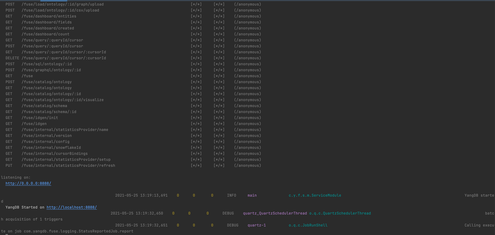
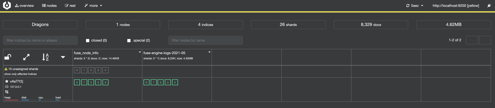
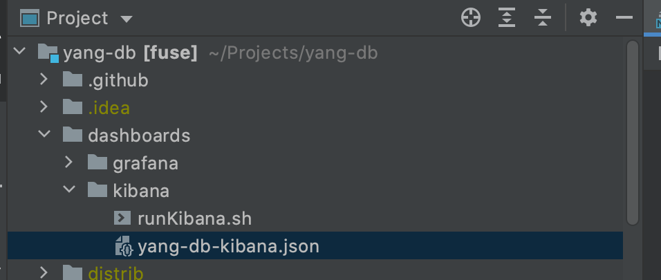
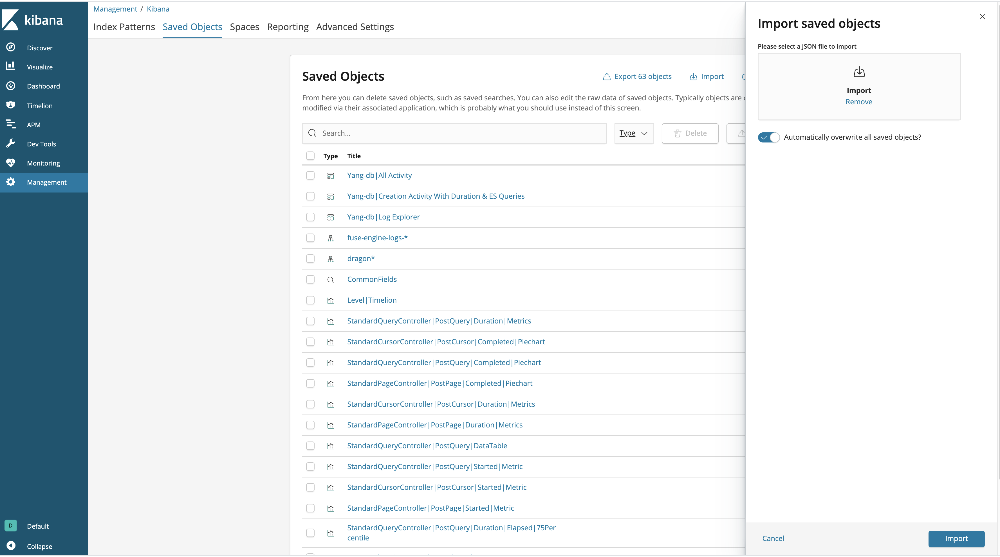
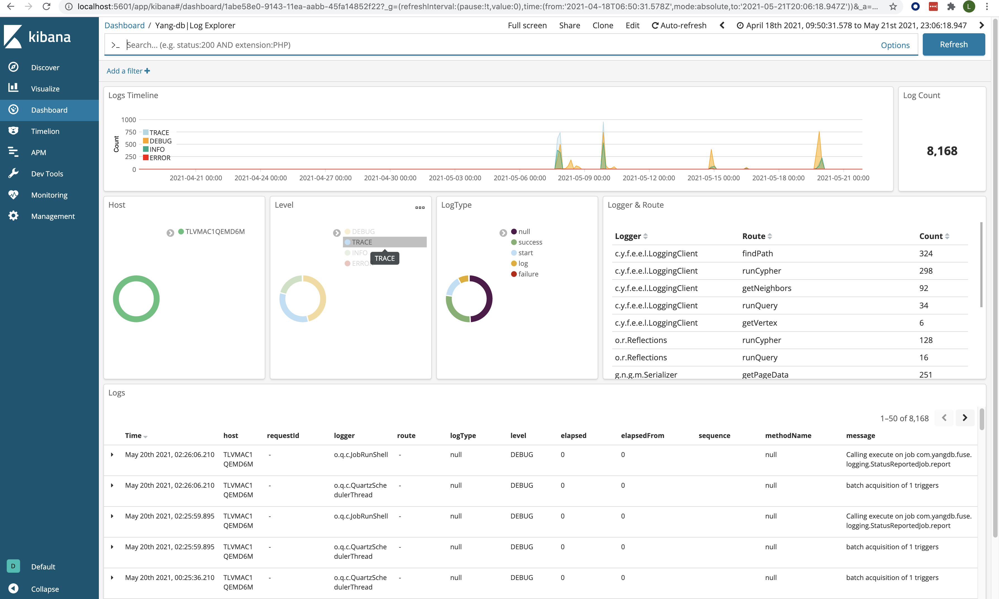

## My First Tutorial - Installation

The purpose of this document is to give a very simple & intuitive way to create and interact with YangDB graph engine so that
One can evaluate and understand the basic use case and usage patterns of this framework.

This tutorial will be a step by step with image illustration from the basic setup of elastic / kibana / yangdb - icluding the
Initiating schema & data loading till the actual query and reviewing the results.

### Why not use docker ?

During this tutorial we will be using RPM installation of the tools used inside this guide - it is very much possible to use
Docker / docker-compose for all the usage describes below, my choice for using the RPM distribution of the tools was made to allow
the simplicity and clearity of the tutorial without getting into the additional complexities of docker-compose and its related env dependencies.

The docker-compose guide is available in the documentation folder as well...

## Step 1 - Getting all the Tools

The following tool are necessary for the tutorial process and for general usage and evaluation of this framework

- Elastcsearch  ( https://www.elastic.co/downloads/past-releases/elasticsearch-6-5-4 )
- Kibana        (https://www.elastic.co/downloads/past-releases/kibana-6-5-4)
- Cerebro       (https://github.com/lmenezes/cerebro/releases)
- YangDB        (https://github.com/YANG-DB/yang-db/releases/download/v0.5/dragon.tar)

## Step 2 - Running the tools

---

### Running elasticsearch

This is simple & easy - just go to the installation folder / bin and run the elasticsearch.sh executable
Configuration of the cluster is also needed in order to allow yangDB to access the demo default cluster, just edit the

elasticsearch.yml file in the config folder and add the following line:

     cluster.name: Dragons   # the culster name
     xpack.ml.enabled: false # disable xpack which is uder payed license

Once this is done you can run the elasticsearch server - ports 9200 & 9300 must be avialable...

---
### Running kibana

Again - this is easy to execute, just go to the bin folder under the installation location and run the kibana executable
The kibana should be able to connect to the running elasticsearch server via 9200 port

---
### Running Cerebro

Cerebro is an open source management tool for elasticsearch server which simplify the usage and maintenance of elasticsearch cluster
It has a web ui that uses port 9000 to connect to the elastic server, running it is done using the cerebro executable that resided
in the bin folder under the installation location.

- Cerebro ES cluster view
  

---
### Running YangDB

**YangDB is a graph execution engine on top of elasticsearch, it has a REST API interface that allows interacting with it.**

Running yangDb from its installation folder (after un-tar the downloaded artifact) is simple, it is done via the
start-fuse-service.sh script in the installation folder.

#### Configuration for YangDB

When one needs to configure the yangDb server he should open the application.conf file under the config folder.
The default configuration for the demo is named Dragons and is wrapped around a game of thrones dats scenario.

The yangDb artifact has a in-process embedded elasticsearch server which - in our case, need to be disabled from loading
since we are using an external elasticsearch server .

Disabling the in-process elasticsearch in the application.conf

_This should be the final configuration for the elasticsearch connection_

        ...
        elasticsearch.embedded = false
        elasticsearch.delete_data_on_load = false
        elasticsearch.hosts = [ "localhost" ]
        elasticsearch.port = 9300
        elasticsearch.cluster_name = Dragons
        ...

Once this is done we can start the yangDb server (using the script mentioned above)

#### Calling the run script:
The next logging result should be apparent:

#### Access the swagger web UI:

As it states -  the url  http://0.0.0.0:8888/  is available, we will focus our attention to the
REST API swagger page http://localhost:8888/swagger

After the swagger is shown we can view in cerebro web ui the default log & system indexes that yang db creates once it's attached to elastic

These indexes are used for logging the activities of the graph server as well as storage of system data relevant to its internal
functionalities and behavior.

Once the logging index is alive we can view the specially drafted kibana dashboards made to monitor and observe yangDb

---
### Setup YangDb Kibana Dashboards

#### Load custom Kibana dashboards

We will load the next prepared kibana dashboards located in the dashboard folder:

**Loading the json dashboard to kibana..**

In Kibana toolbar, navigate to Settings » Objects tab.
Click the Import button and select the Dashboards. json.

Once these dashboards are loaded into kibana we can view their appearance:

#### The list of available yangDb dashboards

#### The yangDb og dashboard

### What's next ?
Now that we've installed all the necessary tool and started them - we can continue to the next tutorial in which we will
start talking about our demo use case  - the Dragons Ontology (HBO's Game Of Thrown)
