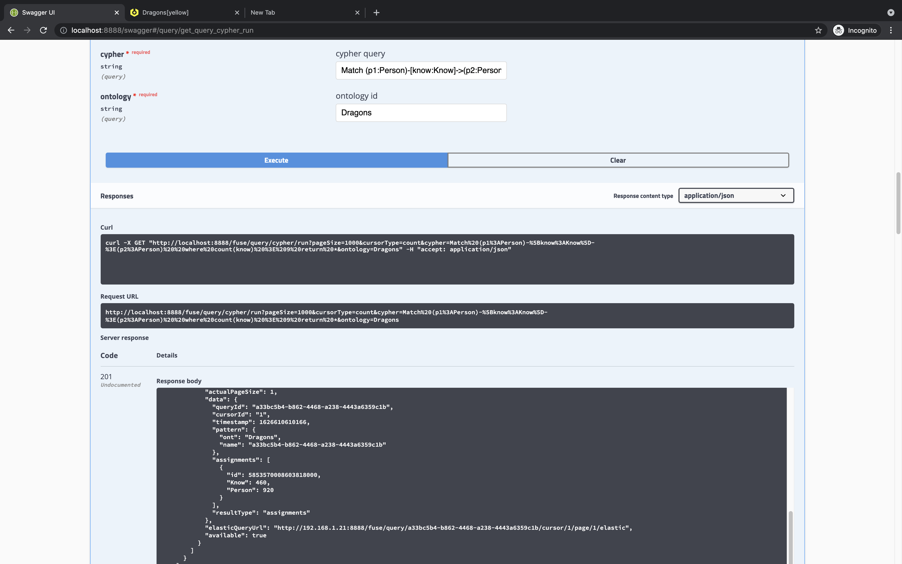
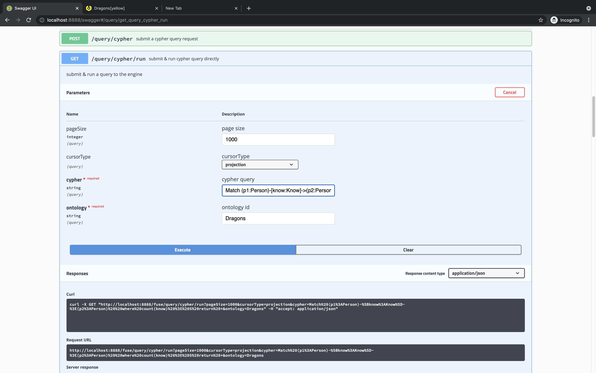
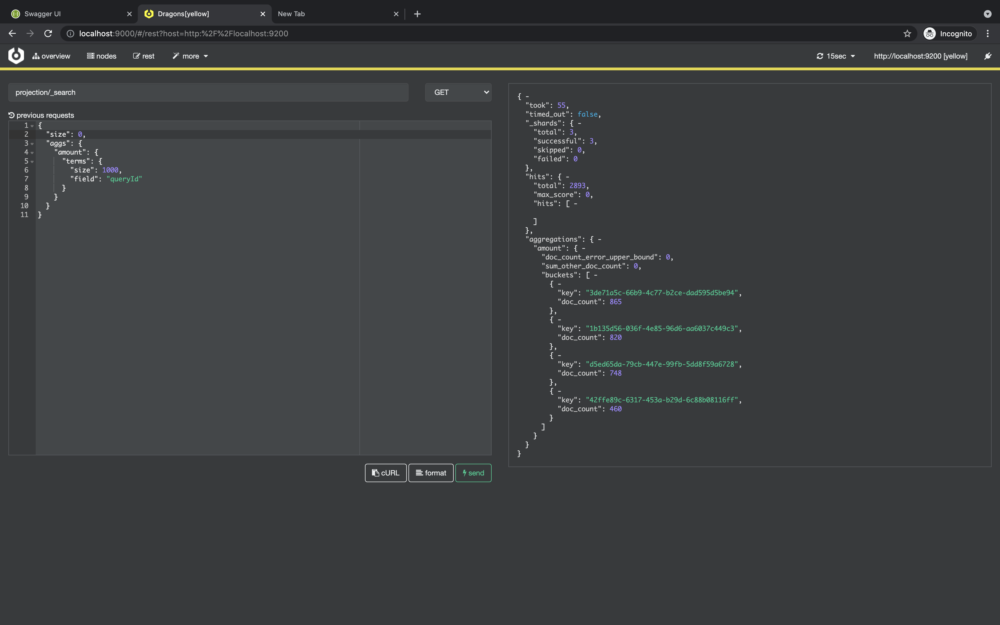

#Projection & Count Cursors
In this tutorial we will review different type of cursors that enable us to materialize queries and count results

###Count
The purpose of this cursor is to supply a way to exactly count the amount of labels a given query is returning without actually fetching the entire documents into memory:

We should use this cursor in the case that we need to understand the amount of results (assignments) returning from a query.
Once such a query with the "count" cursor is submitted - the engine accumulates the resulting labels in each row - once no more results are available it returns the exact number of
labels that appeared in the response:

we use the following query:
```
Match (p1:Person)-[o:Own]-(d1:Dragon) WHERE count(o) > 50 AND d1.color = BLACK  return *
```


We can observe that result assignments contains the following lables:

```
"assignments": [
                {
                  "Know": 460,
                  "Person": 920
                }
               ]
```


-----
###Projection (Materialization)

The purpose of this cursor is to provide a consistent and general way to project a (general) query results into a dedicated projection index
This index will be used to store the returning query-results assignments inside a single index, it will also be able to efficiently perform slice & dice over the resulting assignments using
the efficient E/S aggregation DSL.

For additional details refer to [index-projection-details](../../../docs/branch/indexProjection.md)


###Usage
Since we concluded that want to project the query results - lets actually run the query with the projection cursor and see what happens:

####Swagger
The regular API can be called with the following query:


```
Match (p1:Person)-[o:Own]-(d1:Dragon) WHERE count(o) > 50 AND d1.color = BLACK  return *
```

The only difference would be the type of cursor that is selected - projection.
The result will reflect the amount of elements ingested into the projection index - this API can is syncronized so the waiting time for the query to complete
depends on the amount of results the query returns.



If you want to get notified when the projection completes - this API will soon be available under notification...

###Consumption API
Once the query has started materialization of the results into the projection index - we can see the amount of results (assignments) mounting up
as shown here of the projection index aggregation of different documents per projected-query.




As mentioned before - each document in the projection index represents a assignment result (a single row).
It is possible to start consuming the results using a dedicated consume API.
The consumption API is similar to the standard _getData_ API in that it returns paginated data from the materialized query result index.
The difference is that the consume API is dedicated for stream like consumption from a source - in our case this source is the projection index.

